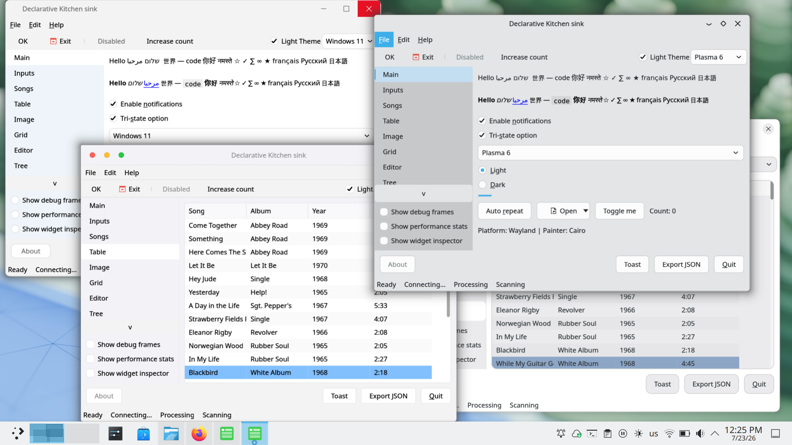

# Toolkit

A C++20 GUI toolkit with Cairo-based rendering and native platform backends for
macOS, Windows, and Linux (X11 and Wayland).



The main goal is to make a toolkit comparable to Qt-Widgets, in C+++20. Trying
to make as many 3rd parties as possible, trying to avoid the NIH syndrome. It uses
STL, and smart pointers everythwere. There are platform abstractions to use "native"
painters:

- on Windows, `Painter` is a `GDIPainter` and `TextRasterizer` is
  `Win32TextRasterizer`.
- on Windows image loader is `Win32ImageLoader` which uses Windows APIS, to load
  pngs, jpg etc.
- You as a developer can still opt out, and use [STB](https://github.com/nothings/stb)
  for image loading and rasterizing text.

This should lead to relatively small binaries on Windows and macOS.
On linux the demos are about 4.6MB after stripping.

Homepage: https://diegoiast.github.io/get-svision3/

## Features

- Layouts: `HBoxLayout`, `VBoxLayout` with margins, spacing, and stretch factors
- Widgets: `Button`, `Label`, `Checkbox`, `RadioButton`, `Combobox`, `LineInput`,
  `SpinBox`, `ProgressBar`, `TabWidget`, `ListView`, `ContextMenu`
- Keyboard navigation (Tab/Shift-Tab), mnemonics (`&ok` renders as underlined `o`),
  focus management
- Menus, toolbars. popups and dialogs (including using native file dialogs, or
  toolkit dialogs on request).
- Clipboard (copy/paste), timers, tooltips, cursor shapes
- Markdown support, using [litethtml](https://github.com/litehtml/litehtml), meaning
  you can also display simple HTML documents.
- Filterable list adapter with async progress reporting.
- Thread-safe `Application::post_to_main_thread()` for background work.
- Client side decorations on all platforms.
- Multiple theme styles (macOS, Windows, Linux) and color schemes (Light, Dark).
- Runtime backend selection via environment variables.
- Widget instrospoection on runtime (view properties, or layouts).
- XDG icon support (even on Windows and macOS - you just need to provide a theme).
- SQLite support. API is flixible to support other DBMS.
- Ability to dump the UI state into JSON and reload it later on.
- Available on connan.io (soon).

## Platform & Rendering Matrix

| Platform | Windowing System | Rendering Backend | Selection Environment |
|----------|------------------|-------------------|-----------------------|
| **macOS**| Cocoa/AppKit     | CoreGraphics      | `SVISION_PAINT=native` (Default) |
| **macOS**| Cocoa/AppKit     | OpenGL 2.1        | `SVISION_PAINT=opengl` |
| **Windows**| Win32          | GDI+              | |
| **Windows**| Win32          | OpenGL 2.1        | `SVISION_PAINT=opengl` |
| **Linux**| X11              | Cairo             | `SVISION_PAINT=cairo` (Default) |
| **Linux**| X11              | OpenGL 2.1        | `SVISION_PAINT=opengl` |
| **Linux**| Wayland          | Cairo             | `SVISION_PAINT=cairo` (Default) |
| **Linux**| Wayland          | OpenGL 2.1        | `SVISION_PAINT=opengl` |

On Linux, the windowing system is selected automatically based on the environment, but can be forced:

1. `SVISION_BACKEND` environment variable (`x11` or `wayland`)
2. Presence of `WAYLAND_DISPLAY` (prefers Wayland)
3. Presence of `DISPLAY` (falls back to X11)

The rendering backend (Painter) is selected via the `SVISION_PAINT` environment variable on supported platforms.
OpenGL is currently "not ideal", but it will become usable eventually.

## Dependencies

Managed via [Conan 2](https://conan.io/):

- **cairo** 1.18.0 -- 2D rendering
- **spdlog** 1.14.1 -- logging
- **Catch2** 3.7.1 -- testing

### System dependencies (Linux only)

`harfbuzz` and `freetype` are **required on every Linux distro, regardless of
windowing backend**. They are resolved from your system's package manager
(dynamically linked) rather than built by Conan, to keep resulting binaries
smaller — see
[docs/binary-size-analysis-2026-07-23.md](docs/binary-size-analysis-2026-07-23.md)
for why. If they aren't installed, `cmake --preset conan-release` will fail
to configure with a "could not find harfbuzz/freetype2" error.

## Debian / Ubuntu

```bash
# Always required
sudo apt install libharfbuzz-dev libfreetype-dev

# For X11
sudo apt install libx11-dev

# For Wayland
sudo apt install libwayland-dev wayland-protocols libxkbcommon-dev
```

## Arch Linux

```bash
# Always required (Arch doesn't split headers into separate -dev packages)
sudo pacman -S harfbuzz freetype2

# For X11
sudo pacman -S libx11

# For Wayland
sudo pacman -S wayland wayland-protocols libxkbcommon
```

## Fedora

```bash
sudo dnf install brotli-devel xorg-x11-proto-devel bzip2-devel \
    harfbuzz-devel \
    wayland-devel wayland-protocols-devel libxkbcommon-devel mesa-libEGL-devel mesa-libGL-devel libepoxy-devel \
    cairo-devel fontconfig-devel freetype-devel glib2-devel pixman-devel \
    xz-devel libfontenc-devel libXaw-devel libXcomposite-devel \
    libXcursor-devel libXdmcp-devel libXtst-devel libXinerama-devel \
    libxkbfile-devel libXrandr-devel libXres-devel libXScrnSaver-devel \
    xcb-util-wm-devel xcb-util-image-devel xcb-util-keysyms-devel \
    xcb-util-renderutil-devel libXdamage-devel libXxf86vm-devel \
    libXv-devel xcb-util-devel libuuid-devel xcb-util-cursor-devel
```

## Other Linux distributions

Any distro works as long as `pkg-config` and/or CMake's own `find_package` can
locate `harfbuzz` and `freetype2`, plus your windowing system's development
headers. Install the equivalent `-dev`/`-devel` packages for:

- `harfbuzz`
- `freetype2`
- `libx11` (X11) and/or `wayland` + `wayland-protocols` + `libxkbcommon` (Wayland)
- `cairo`, `fontconfig`

## Building

### Install Conan dependencies

```bash
conan install . --build=missing
```

### Configure and build

For single-config generators (Ninja, Makefiles):

```bash
cmake --preset conan-release
cmake --build build/Release
```

For multi-config generators (Visual Studio on Windows):

```bash
cmake --preset conan-default
cmake --build --preset conan-release
```

For a debug build (we just hijack the default profile, and modify
the build type):

```bash

# If on Windows (Visual Studio):
conan install . -pr=default -s build_type=Debug --build=missing
cmake --preset conan-default
cmake --build --preset conan-debug

# If on Linux/macOS (Ninja/Make):
conan install . -s build_type=Debug --build=missing
cmake --preset conan-debug -G Ninja
cmake --build --preset conan-debug
```

### Run

```bash
./build/Release/demo
```

### Run tests

```bash
./build/Release/tests
```

## Project structure

```text
include/toolkit/         Public headers
  application.hpp        Application lifecycle, window creation
  window.hpp             Window: widget tree, events, timers, tooltips
  widget.hpp             Base widget class
  platform.hpp           PlatformApplication / PlatformWindow interfaces
  painter.hpp            Cairo-based painting API
  theme.hpp              Theming system
  clipboard.hpp          Clipboard access
  events.hpp             MouseEvent, KeyEvent types
  types.hpp              Point, Size, Rect, Color, CursorShape, Key
  layout.hpp             HBoxLayout, VBoxLayout
  button.hpp             Button widget
  label.hpp              Label widget (multi-line, shrinkable)
  checkbox.hpp           Checkbox widget
  radio_button.hpp       RadioButton + RadioGroup
  combobox.hpp           Dropdown combobox
  line_input.hpp         Single-line text input with selection
  spin_box.hpp           Numeric spin box
  progress_bar.hpp       Progress bar
  tab_widget.hpp         Tabbed container
  list_view.hpp          Scrollable list with adapters
  context_menu.hpp       Popup context menu
  command.hpp            Keyboard shortcut commands
  stopwatch.hpp          High-resolution timer utility

src/toolkit/             Implementation
  platform_factory.cpp   Backend selection + Application/Clipboard impl
  window.cpp             Shared window logic (delegates to platform)
  platform/
    macos/               macOS backend (Cocoa, CoreGraphics)
    x11/                 X11 backend (Xlib, cairo-xlib)
    win32/               Win32 backend (user32, gdi32)
    wayland/             Wayland backend (libwayland, xdg-shell, xkbcommon)

demo/main.cpp            Demo application
tests/                   Catch2 test suite
```

## Architecture

`Application` and `Window` use the PIMPL pattern to delegate platform-specific
work to virtual interfaces (`PlatformApplication`, `PlatformWindow`). Each
backend provides concrete implementations:

```text
Application  -->  PlatformApplication  -->  MacOSCairoPlatformApplication
                                            MacOSNativePlatformApplication
                                            MacOSOpenGLPlatformApplication
                                            X11PlatformApplication
                                            Win32PlatformApplication
                                            WaylandPlatformApplication

Window       -->  PlatformWindow       -->  MacOSCairoPlatformWindow
                                            MacOSNativePlatformWindow
                                            MacOSOpenGLPlatformWindow
                                            X11PlatformWindow
                                            Win32PlatformWindow
                                            WaylandPlatformWindow
```

The factory function `create_platform_application()` in `platform_factory.cpp`
instantiates the correct backend. On Linux, this happens at runtime based on
environment detection. On macOS and Windows, it's a compile-time decision.

All rendering goes through the abstract `Painter` interface. The toolkit provides two main implementations:

- `CairoPainter`: Uses the Cairo graphics library for high-quality 2D vector graphics.
- `GLPainter`: A hardware-accelerated OpenGL 2.1 implementation.

For text rendering in OpenGL, the toolkit utilizes a `TextRasterizer` interface with platform-specific implementations (CoreText on macOS, Cairo on Linux).

## Usage example

```cpp
#include "toolkit/application.hpp"
#include "toolkit/button.hpp"
#include "toolkit/label.hpp"
#include "toolkit/layout.hpp"
#include "toolkit/window.hpp"

int main() {
    toolkit::Application app;
    auto *window = app.create_window("Hello", {400, 200});

    auto root = std::make_unique<toolkit::VBoxLayout>();
    root->set_margins({20, 20, 20, 20});
    root->set_spacing(12);

    root->add_widget(std::make_unique<toolkit::Label>("Hello, world!"));

    auto btn = std::make_unique<toolkit::Button>("&Quit");
    btn->on_click = [window] { window->close(); };
    root->add_widget(std::move(btn));

    window->set_root(std::move(root));
    window->show();
    return app.run();
}
```
